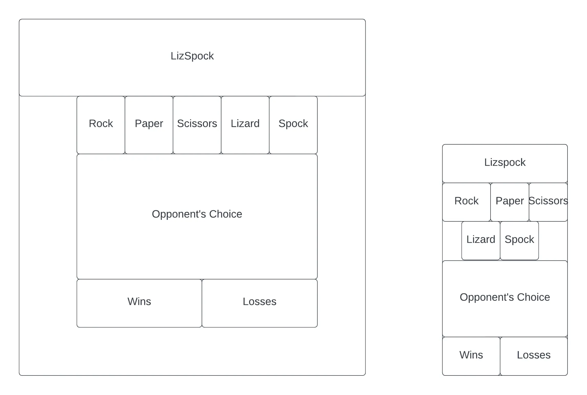
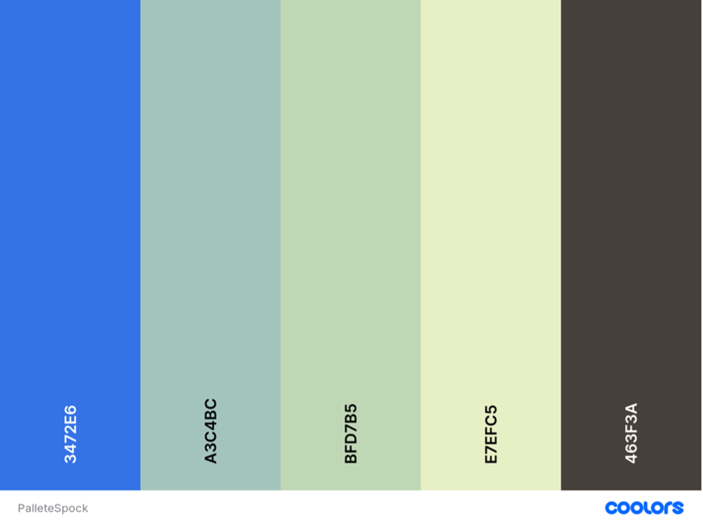
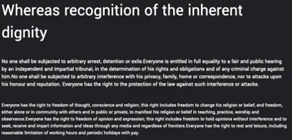
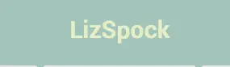
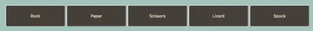
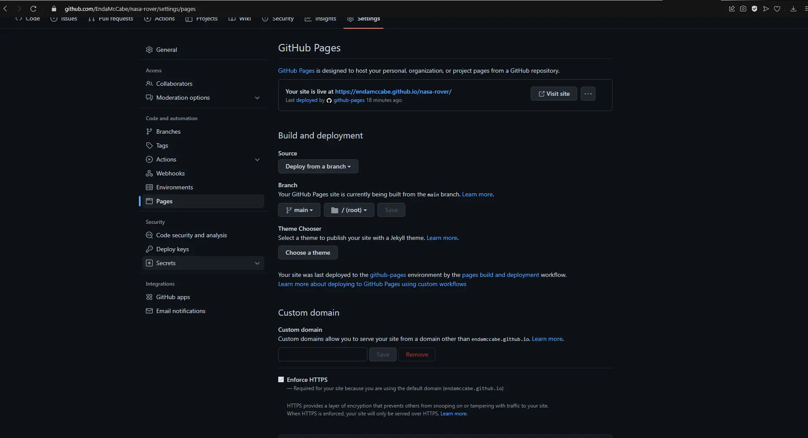

<h1 align="center">Overview of Project</h1>

[Click to see the website] (https://endamccabe.github.io/LizSpock/)
<h2 align="center" text-weight="bold">User Experience<h2>
 
<h2>Use Cases</h2>

As the end user I would like:

<ul>
  <li>As a user, I want to enjoy the game
  <li>As a user, I want to learn the rules of rock, paper, scissors, lizard, rock</li>
  <li>As a user, I want to see how the counters will go after multiple uses</li>
  <li>As a user, I want to see if I can break the website</li>
</ul>
<h2 align="center">Aims</h2>
 
<ul>
  <li>Aim to create a simple page to demonstrate an alternative to rock paper scissors game on a webpage</li>
  <li>To show that Sheldon was right</li>
  <li>To provide a simple casual game</li>
</ul>
<h2 align="center">Wireframes</h2>
 
<h3 align="center">Website and Mobile Wireframes</h3>
 

 
<h2 align="center">Colour Palette</h2>
 

I went to https://coolors.co/ to find the colour palette that would work for this website. These colours have an soft feel to them that I believe is the right choice to welcome to user.

 
<h2 align="center">Typography</h2>

I will be using Yamanatrav regular 400 for the typography of the website. I found this font on google fonts https://fonts.google.com/ . This is an example of the font.

 

 

I believe this style will be a good fit for my vision for the website.

<h2 align="center">Features</h2>
 
<h3 align="center">Heading</h3>
 

This header will be able to go back to the landing page where the rules of the game will be available to be seen. This heading has a simple design to make the user focus on the game and let them enjoy it better.

 
<h3 align="center">Buttons</h3>
 

 

This is the controls for the user in the game to use to make choices at which option they would like to pick. For example if the user picks the rock button, this will then use this as the user option and compare it to the computer's option and result in a win/loss or draw scenario

 
<h3 align="center">Game Area</h3>
 

 

This is the area that is used to show the output of the game which shows the choice of the user vs the choice of the computer and tells the user the result. This is where the user's focus will primarily put on so a contrasting background colour was chosen for it.

 
<h3 align="center">Score Tally</h3>
 

 

This is a score counter that tracks the results of all games that are played when user goes on this website. For example when the user wins the wins counter goes up 1 every time they win, and that is the same for the draw and loss counters.

 
<h2 align="center">Technologies Used:</h2>
 
<ul>
  <li>HTML</li>
  <li>CSS</li>
  <li>Javascript</li>
  <li>Git</li>
  <li>Github</li>
</ul>
<h2 align="center">Deployment</h2>
 

Github Pages was used to deploy this website

 

 
<ol>
    <li>Click "Settings" tab in the Github repository</li>
    <li>Click "Pages" on the left hand side</li>
    <li>Find "Source" and choose the main branch</li>
    <li>Click "Save"</li>
    <li>After this the website should be deployed</li>
</ol>
 
<h1>Creating a local clone of the Project</h1>
 

If you would like to clone my project i will give you the git command on how to do so

 
<ul>
    <li>git clone https://github.com/EndaMcCabe/LizSpock.git</li>
</ul>
